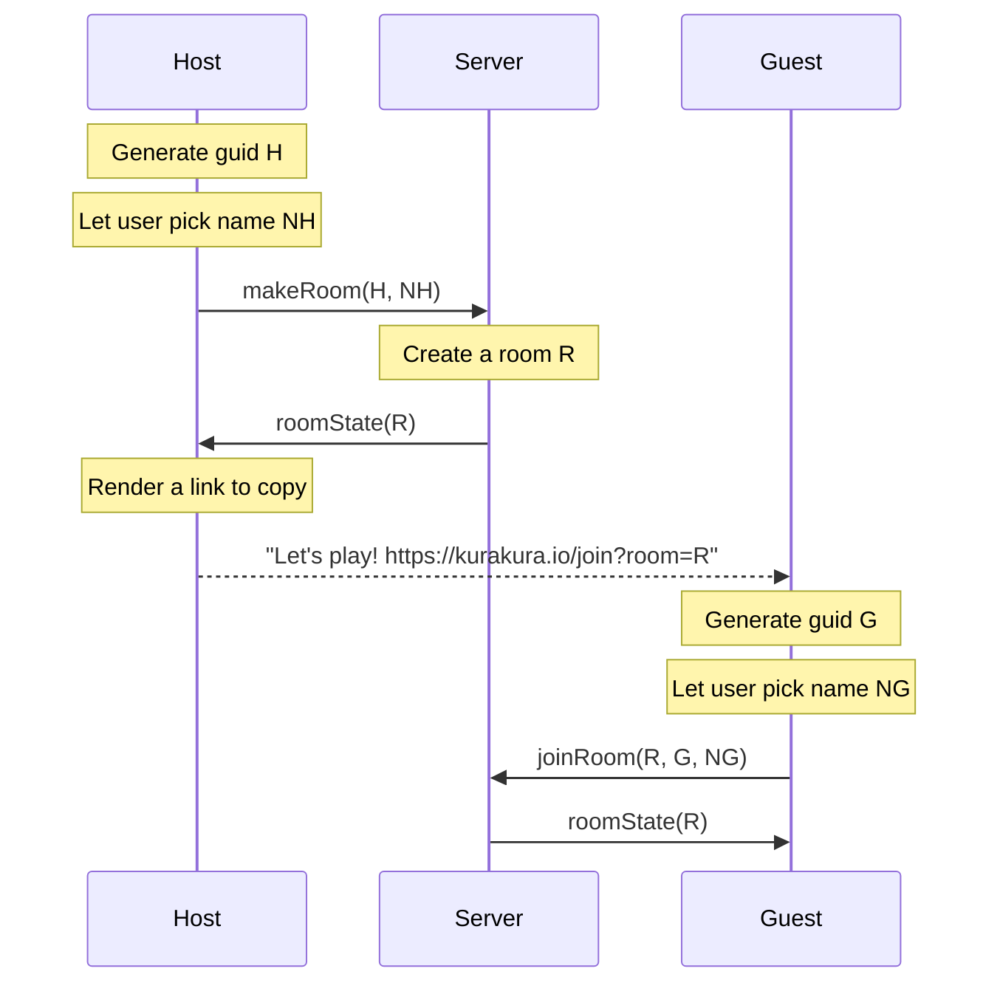

# Initialization

```mermaid
sequenceDiagram
Note over Host: Generate guid H
Note over Host: Let user pick name NH
Host ->> Server: makeRoom(H, NH)
Note over Server: Create a room R
Server ->> Host: roomState(R)
Note over Host: Render a link to copy
Host -->> Guest: "Let's play! https://kurakura.io/join?room=R"
Note over Guest: Generate guid G
Note over Guest: Let user pick name NG
Guest ->> Server: joinRoom(R, G, NG)
Server ->> Guest: roomState(R)
```
