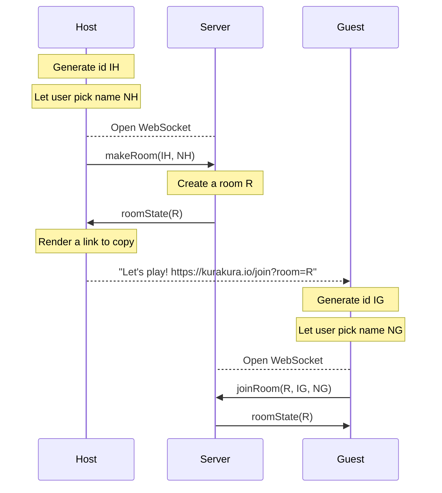
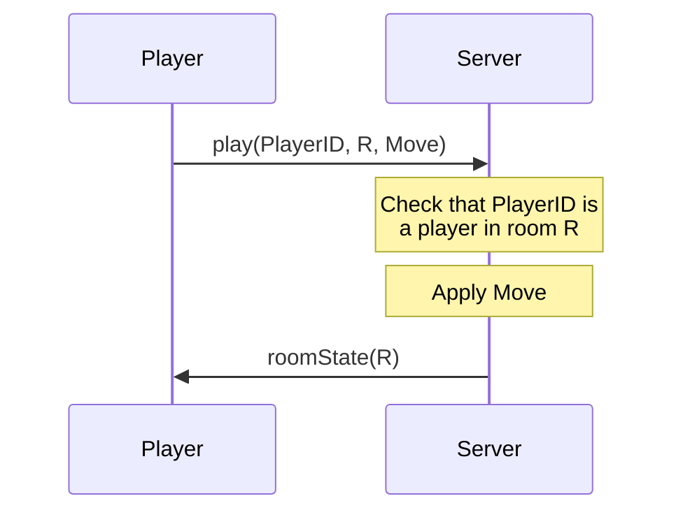

## Model
```rs
struct Player {
  id: String, // A random GUID
  name: String, // Something they type in
}

struct Room {
  id: String, // A random GUID, part of the invite link
  host: Player,
  guest: Option<Player>,  // If None, we're waiting for them to join
  game: Option<Game>,  // If None, we're waiting to start a new game
}

struct ServerState {
  rooms: HashMap<String, Room>,  // maps Room IDs to Rooms
}
```

## Initialization


## Play loop


## Thoughts
* Make it resilient to closing the browser window:
  * **Client:** Persist player GUID to LocalStorage. Reuse instead of generating a new one
  * **Server:** Make joinRoom work if the ID matches a player already in the room
  * **Server:** Always respond with the entire room/game state (it's tiny anyway)

